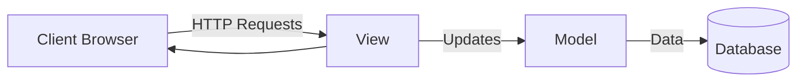
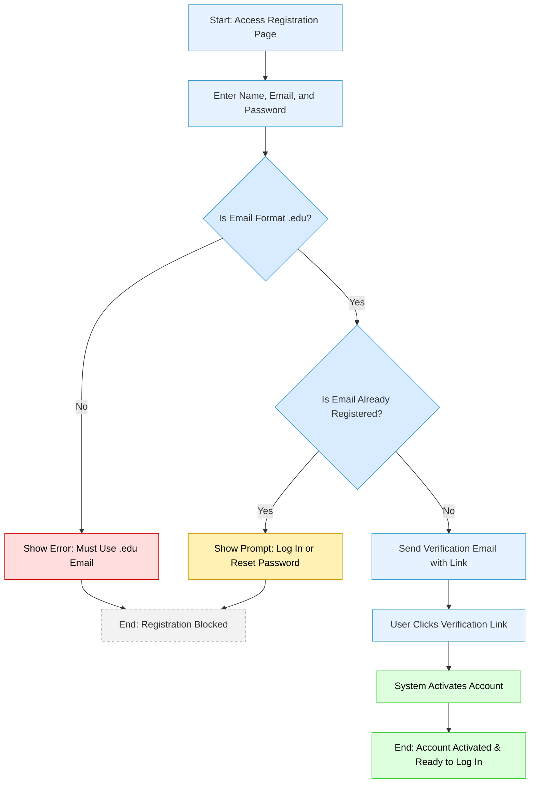

# 📘 StudySync – Design Document (Deliverable 2)

**Course:** CEN4010 – Software Engineering  
**Semester:** Summer 2025  
**Team:** Group 3 – StudySync  

---

## 1. Introduction

This document details the software design for **StudySync**, a web-based platform that enables university students to create, find, and join study groups. The design focuses on a clear separation of concerns, modular development, and user-centric features to streamline group collaboration.

---

## 2. High-Level Architecture

**Architecture Style:**  
Model-View-Controller (MVC)

**Overview:**

- **Model:** Manages application data, including users, study groups, and events.
- **View:** Renders dynamic HTML/CSS for user interaction.
- **Controller:** Handles incoming requests, updates the model, and selects the appropriate view.




---

## 3. Detailed System Design

### 3.1 Use Case Diagram



**Description:**  
Shows how users (Students, Administrators) interact with the system: creating accounts, joining groups, messaging, and managing events.

---

### 3.2 Class Diagram

```

\[Diagram Placeholder: Class Diagram]

```

**Key Classes:**

- `User`: Stores user profile and authentication.
- `StudyGroup`: Represents a group, members, and group details.
- `Message`: Contains chat/message data.
- `Event`: Handles scheduled study sessions.
- `Calendar`: Manages calendar display and navigation.
- `Notification`: Handles reminders and alerts.

---

### 3.3 Sequence Diagram

```

\[Diagram Placeholder: Sequence Diagram]

```

**Example:**  
User joining a study group.

User scheduling an event for a study group.


---

### 3.4 Activity Diagram

```

\[Diagram Placeholder: Activity Diagram]

```

**Example:**  
Workflow of creating a new study group.

---

## 4. Data Structures

- **User Records:** Stored in relational tables (MySQL).
- **Group Membership:** Many-to-many mapping between users and groups.
- **Messages:** Stored with timestamps and sender references.
- **Events:** Stored as JSON objects with date, time, title and group reference.
- **Notifications:** Queue-based structure for pending reminders.

---

## 5. Algorithms

- **Search Algorithm:**  
  Keyword-based search for groups and events.

- **Recommendation Algorithm:**  
  Simple matching based on shared courses/interests.

- **Calendar Generation Algorithm**  
  Calculates the first day of the month, and generates a grid layout with proper day alignment.

- **Reminder Algorithm:**  
  Checks the current time against the event times, minus the reminder offset, to trigger notifications. 
  
---

## 6. Interface Design

**Wireframes / Mockups:**

- Landing Page
- Group Directory
- Group Details View
- Chat Interface
- Calendar View
- Event Creation Form

**Calendar Interface:**
- Monthly grid view with navigation
- Event indicators (with dots/markings)
- Add Event button with form
- "Upcoming Meetings" sidebar
  
```

\[Insert screenshots or links to Figma/Mockup]

```

---

## 7. Security Considerations

- **Authentication & Authorization:**  
  User sessions managed securely via JWT tokens.

- **Input Validation:**  
  All form inputs sanitized server-side.

- **Data Protection:**  
  Passwords hashed using bcrypt.

- **Access Control:**  
  Role-based permissions for admin actions.

---

## 8. References

- MVC Pattern (Gamma et al.)
- OWASP Top Ten Guidelines
- Figma Design Files *(link if available)*

---

**Prepared by:**  
Group 3  

**Date:** June 30, 2025
```

---

