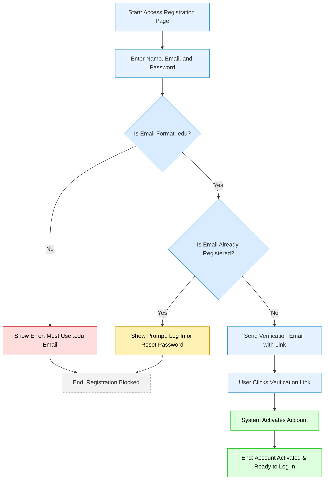
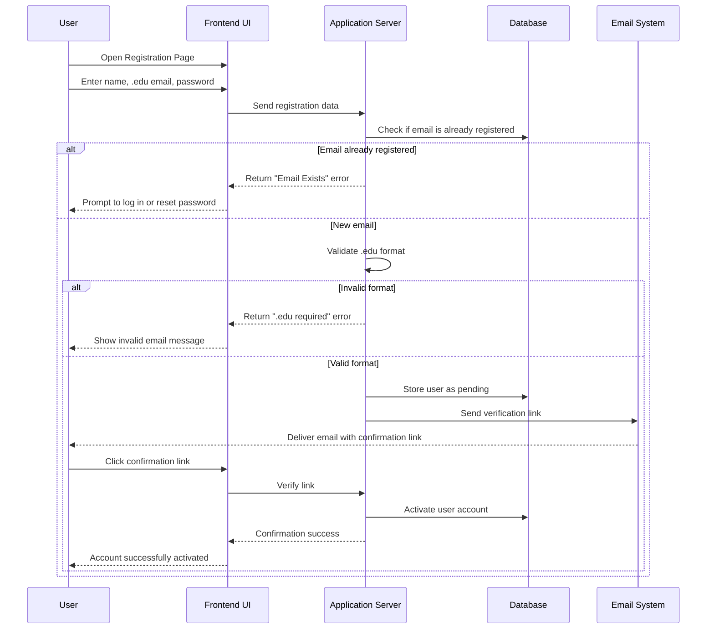
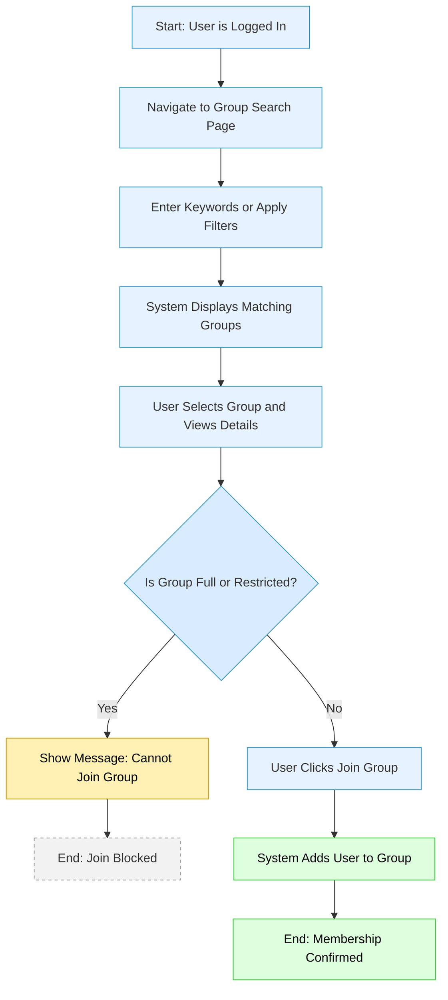
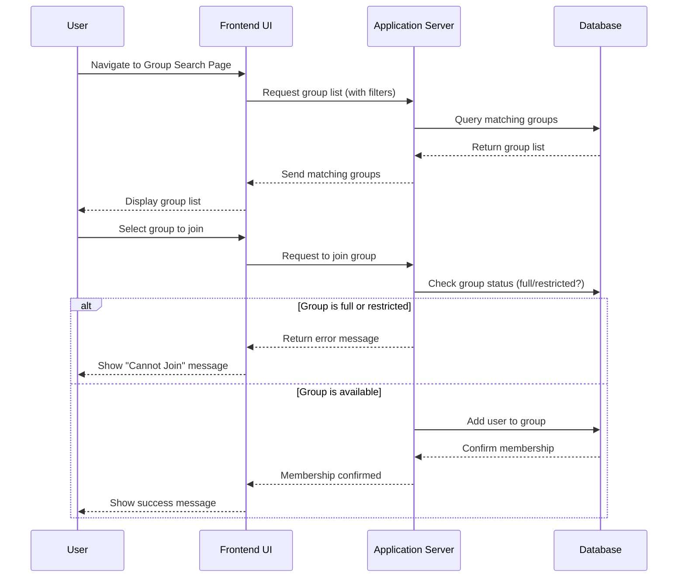
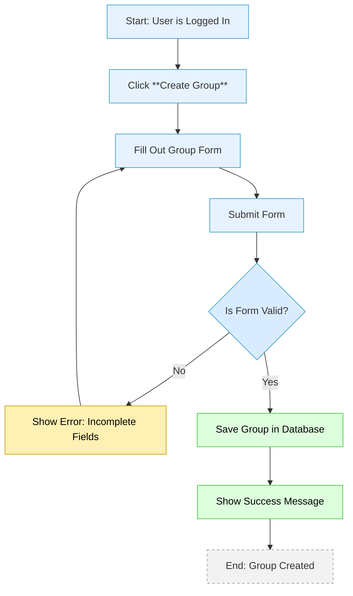
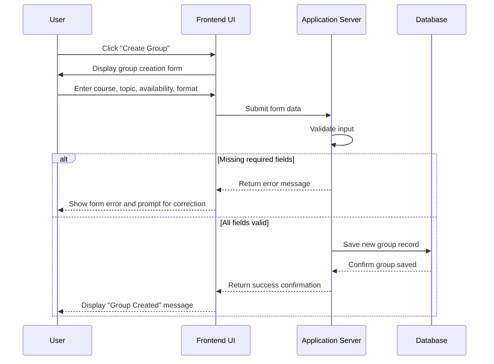
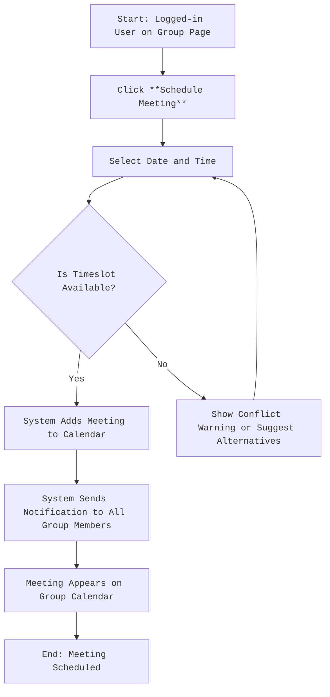
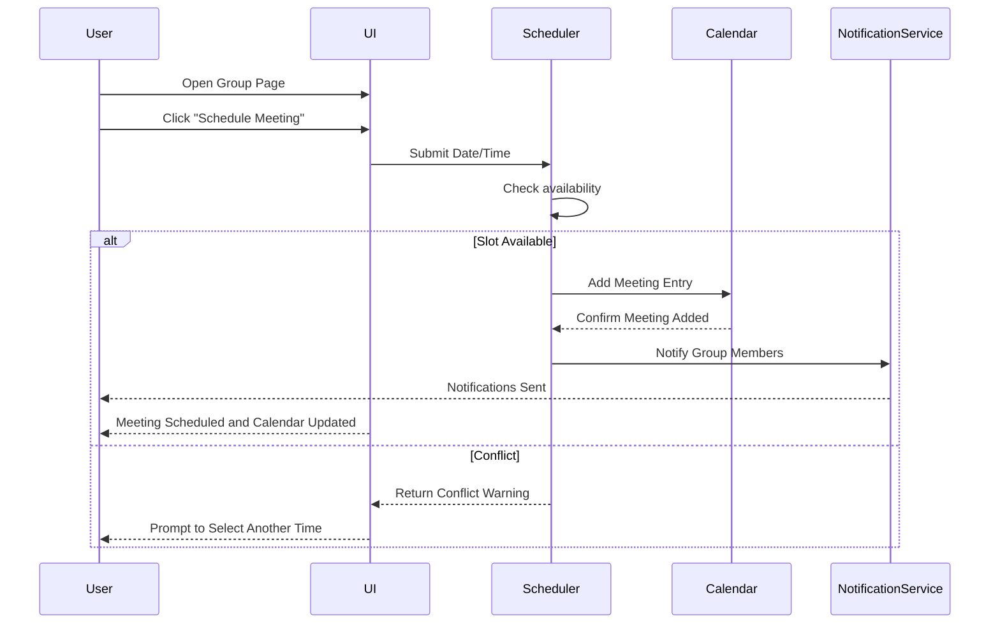
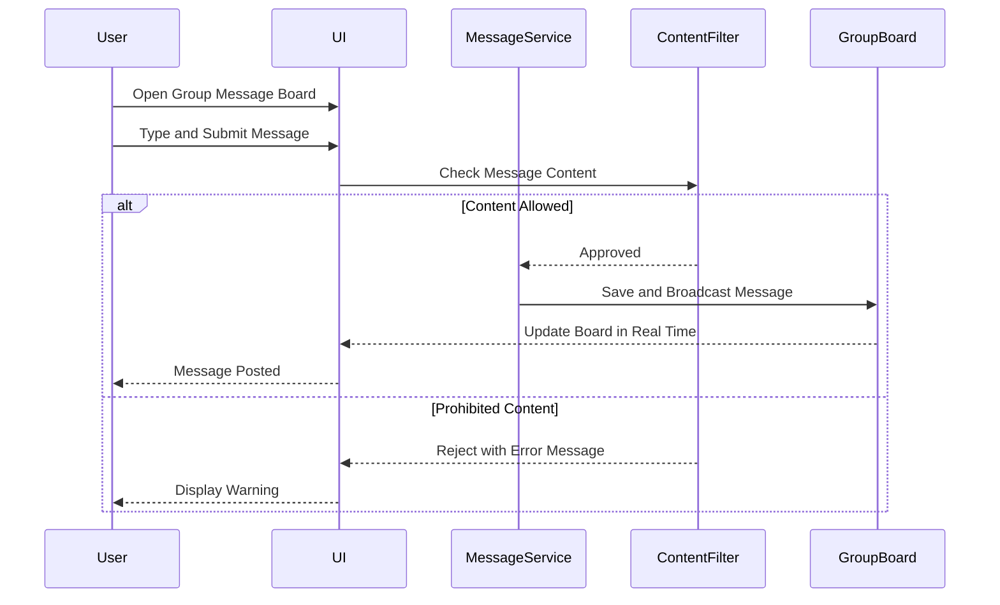

# 📄 Software Requirements Document (SRD) — StudySync

**Course:** CEN4010  
**Semester:** Summer 2025  
**Team:** Eric Jacobs, Juan Diaz-Zuluaga, Joseph Woolley, Erick Cuadra, Cody Chardon  
**Last Updated:** June 2025

---

## 1. 📌 Purpose of the Software

**StudySync** is a web platform designed to simplify the process of forming and joining academic study groups.  
It provides a **centralized, structured environment** where students can:

- Find peers based on shared courses and topics
- Schedule meetings
- Post messages
- Integrate with tools like Zoom and Slack for real-time collaboration

This platform is intended to improve the learning experience, increase engagement, and enhance academic outcomes through structured peer interaction.

---

## 2. 🔎 Scope of the Software

**Included Functionality:**
- User registration with `.edu` email validation
- Secure login/logout
- Group creation and discovery
- Join and leave groups
- Message boards within each group
- Meeting scheduling
- Integration links to Zoom and Slack
- Basic profile management
- Frontend CSV simulation
- Migration to backend database

**Excluded Functionality:**
- Real-time chat (Phase 2+)
- Push notifications (Phase 2+)
- File sharing
- Comprehensive user profile customization

**Phases:**
- **Phase 1:** Frontend implementation in VSCode EDU (HTML/CSS/JS with CSV flat files)
- **Phase 2:** Local Ubuntu dev server backend (Node.js or PHP + MySQL)
- **Phase 3 (Stretch Goal):** Public deployment on GoDaddy

---

## 3. ✅ Functional Requirements

### User Management
- Register account with `.edu` email address
- Verify email with confirmation link (Phase 2)
- Login and logout securely
- View and edit basic profile information

### Group Management
- Create new study groups with:
  - Course/topic tags
  - Meeting preferences (online/in-person)
  - Description
- Browse and search groups by keyword
- Filter groups by course, topic, or meeting type
- Join or leave groups
- View list of groups joined

### Scheduling and Meetings
- Schedule group meetings with date/time
- Display scheduled meetings in group view

### Messaging
- Post messages to group message board
- Display messages chronologically
- Delete own messages (Phase 2)

### External Integration
- Generate links to Zoom meetings
- Connect Slack workspace via webhook (Phase 2)

### Data Management
- Simulate persistence with CSV files in frontend prototype
- Transition to MySQL backend for production

---

## 4. 🔒 Non-Functional Requirements

- 🎯 **Responsive design:** Must work on desktop and mobile
- 🛡️ **Security:** Input validation and HTTPS
- ⚡ **Performance:** Page load < 3 seconds
- 🌐 **Compatibility:** Modern browsers (Chrome, Firefox, Edge, Safari)
- ☁️ **Scalability:** Support growth to 1,000+ users
- ⏱️ **Availability:** 99.5% uptime in production
- 🔄 **Maintainability:** Clear modular code

---

## 5. 🙋‍♂️ Use Cases

### UC1: Register Account Using .edu Email
**Actors:** New User  
**Preconditions:** User has `.edu` email  

**Main Flow:**
1. User accesses registration page
2. Enters name, email, password
3. System checks `.edu` format
4. Sends verification email
5. User clicks link to activate account

**Exceptions:**
- Invalid email format
- Email already registered

---

### UC2: Search and Join Study Groups
**Actors:** Registered User  
**Preconditions:** Logged in  

**Main Flow:**
1. User browses or searches groups
2. System shows matching groups
3. User selects group details
4. User clicks "Join"
5. System adds membership

**Exceptions:**
- Group full or restricted access

---

### UC3: Create New Study Group
**Actors:** Registered User  
**Preconditions:** Logged in  

**Main Flow:**
1. User fills out group creation form
2. System validates input
3. Group is created and listed

**Exceptions:**
- Duplicate group name
- Missing required fields

---

### UC4: Schedule and View Meetings
**Actors:** Group Members  
**Preconditions:** Membership in group  

**Main Flow:**
1. User selects "Schedule Meeting"
2. Chooses date/time
3. Meeting added to calendar
4. Members notified

**Exceptions:**
- Scheduling conflicts

---

### UC5: Post Messages to Group Board
**Actors:** Group Members  
**Preconditions:** Logged in and group member  

**Main Flow:**
1. User types message
2. System saves and displays message

**Exceptions:**
- Prohibited content rejected

  
---

## 6. 📅 Project Milestones

| Milestone               | Target Date       |
|-------------------------|-------------------|
| Proposal Submitted      | May 23, 2025      |
| SRD Submission          | June 14, 2025     |
| Frontend Demo (CSV)     | July 1, 2025      |
| Backend Integration     | July 14, 2025     |
| User Testing            | July 21, 2025     |
| Final Submission        | August 2, 2025    |

---

## 7. 💻 Hardware and Software Requirements

### Development Tools
- VSCode EDU (Frontend-only)
- HTML, CSS, JavaScript
- CSV files for simulation

### Deployment Environment
- Ubuntu Server or GoDaddy Linux hosting
- Node.js or PHP backend
- MySQL database
- Zoom and Slack APIs

---

## 8. 🔗 External Integrations

- **Zoom API:**
  - Schedule meetings
  - Generate meeting links

- **Slack API:**
  - Notify group members
  - Send reminders

---

## 9. 🔐 Security Considerations

- `.edu` domain enforcement
- HTTPS for all endpoints
- Input validation and sanitation
- Access controls for:
  - Group membership
  - Message posting
- Protection from XSS and CSRF

---

## 10. ✨ Future Enhancements (Post-Version 1)

- Real-time chat and notifications
- File sharing within groups
- Push notifications (email/SMS)
- Advanced analytics (group activity tracking)
- Public API for third-party apps

---
